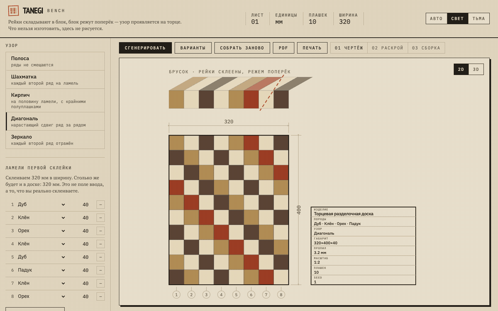
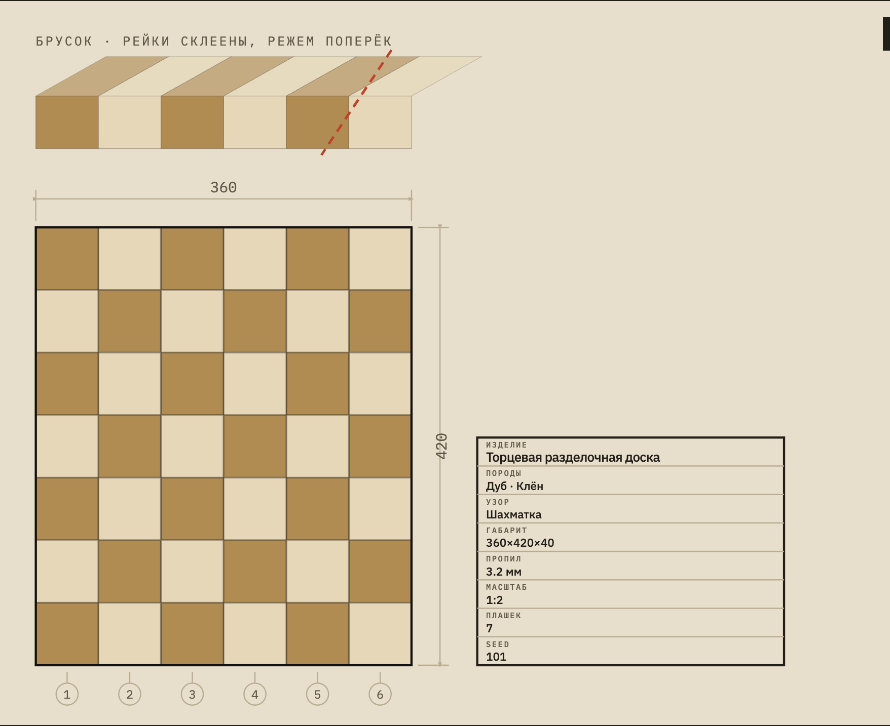
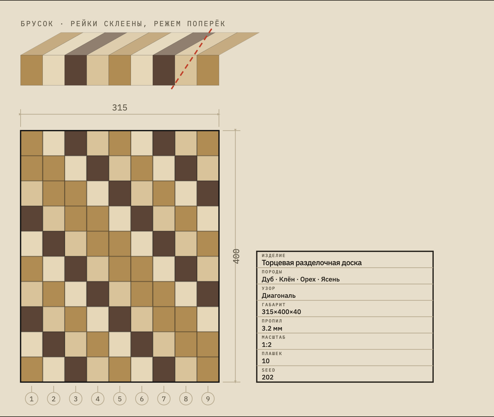
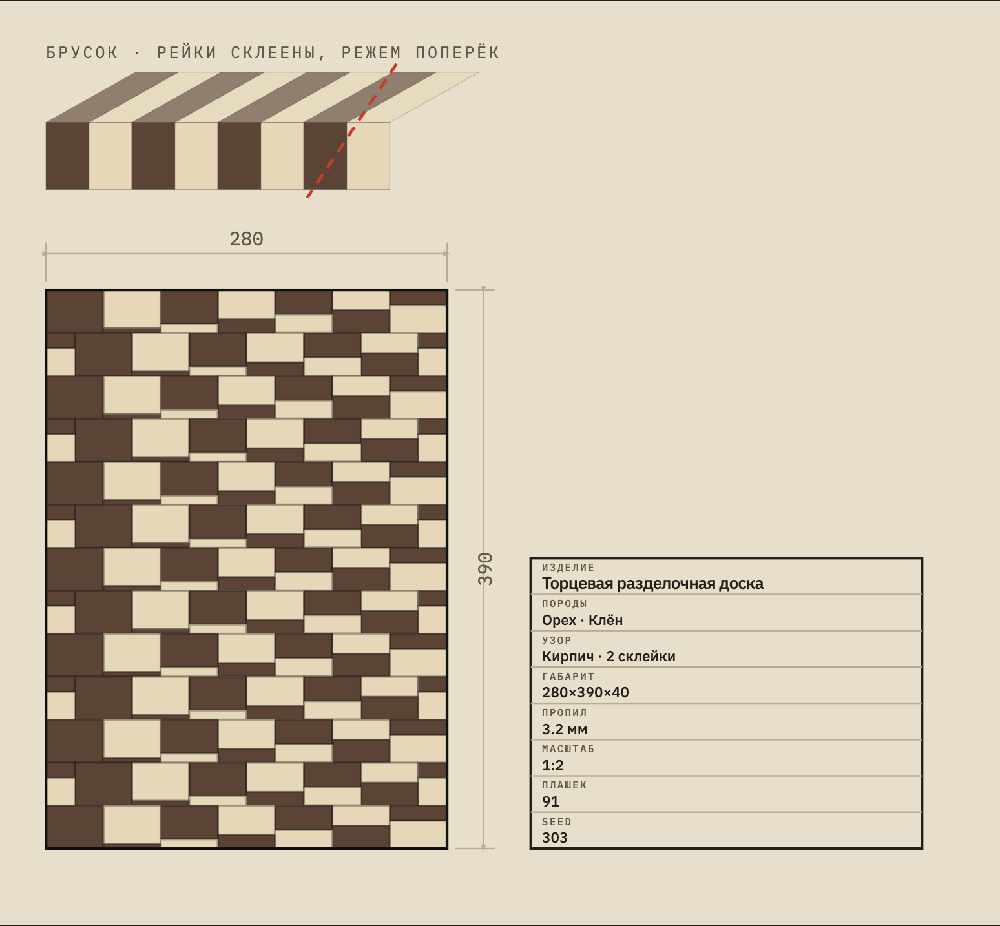
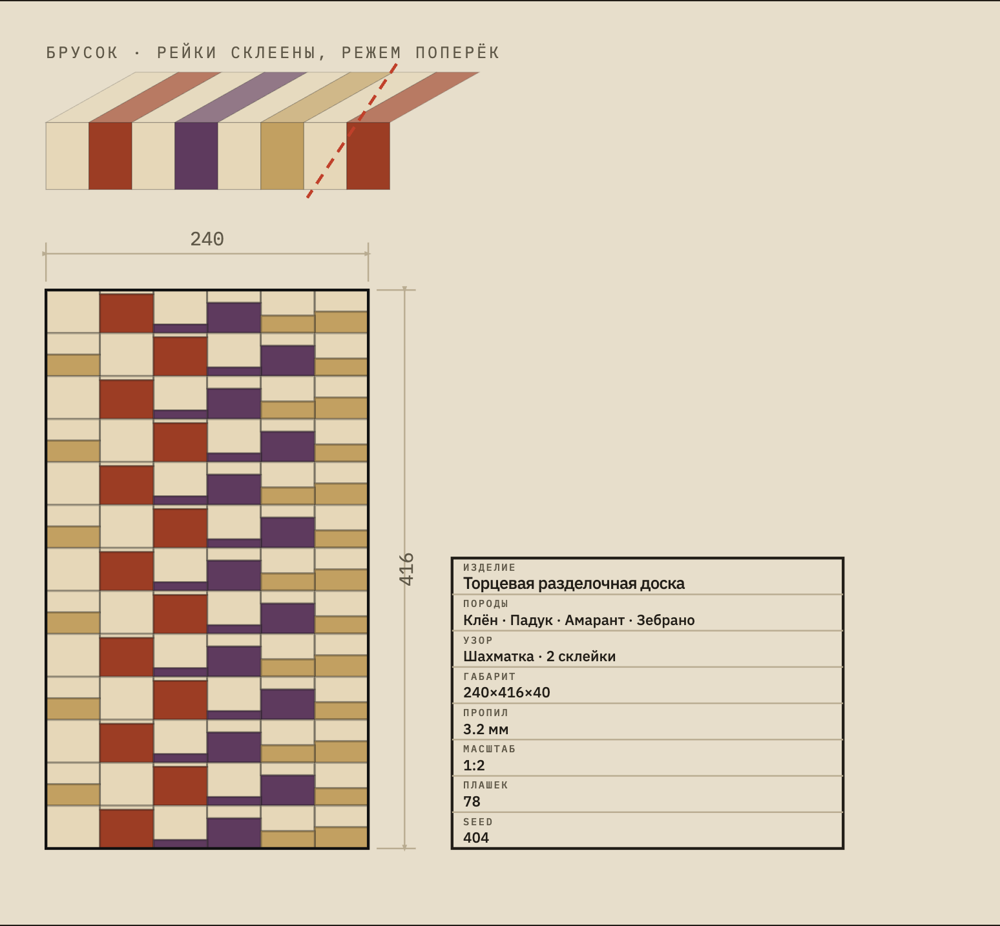

# Tanegi Bench — конструктор торцевых досок

[](https://kudteam153-lab.github.io/tanegi-bench/)
[](https://react.dev/)
[](https://vitejs.dev/)
[](https://www.typescriptlang.org/)

**Tanegi Bench** превращает узор торцевой разделочной доски в понятный проект для мастерской: чертёж, раскрой, смету, порядок резов и PDF на три листа.

👉 **Открыть приложение:** https://kudteam153-lab.github.io/tanegi-bench/



---

## Что это

Обычно генераторы досок рисуют красивую картинку. Tanegi Bench идёт от производства: доска описывается как последовательность столярных операций — склеить ламели, распилить поперёк, развернуть плашки, переклеить, снова распилить.

Из этой модели приложение выводит:

- **узор доски** — 2D-чертёж и 3D-превью;
- **параметры изготовления** — размеры, ламели, породы, пропил, припуски;
- **раскрой и смету** — сколько купить древесины, сколько уйдёт в опилки, сколько стоит материал;
- **пошаговую сборку** — где резать, как развернуть плашки, как клеить;
- **PDF-инструкцию** — распечатал три листа и пошёл к верстаку;
- **share-ссылку** — рецепт хранится прямо в URL, у другого человека откроется та же доска.

---

## Три листа для мастерской

### Лист 01 — чертёж

Размеры доски, штамп проекта и схема: из какого бруска появляется торцевой узор.

### Лист 02 — раскрой и закупка

Что купить, в каком порядке резать и клеить, сколько уйдёт в отходы, сколько стоит материал.

### Лист 03 — сборка

Панель перед каждым резом с намеченными линиями, рядом карта заправки и порядок переклейки.

---

## Примеры узоров

| Крупная шахматка | Диагональ |
|---|---|
|  |  |

| Кирпич с переклейкой | Экзотика |
|---|---|
|  |  |

---

## Почему Tanegi

**種木 / tanegi** — термин из японского ремесла **хаконэ-ёсэги**. Так называют блок из реек, который режут поперёк, чтобы на торце проявился узор.

Торцевая разделочная доска делается похожим способом: сначала собирается заготовка, потом она режется поперёк, плашки разворачиваются торцами вверх — и рисунок становится рабочей поверхностью.

---

## Возможности

- процедурная генерация узора по seed;
- двенадцать вариантов за один запуск;
- мутация и скрещивание отложенных вариантов;
- настройка размеров доски, ламели, толщины, пропила и длины заготовки;
- породы древесины под практическую закупку: дуб, ясень, граб, орех, клён, бук и экзотика;
- предупреждения, если выбранный проект физически не сходится;
- экспорт SVG, PNG и PDF;
- автосохранение в браузере;
- рецепт в ссылке без сервера и базы данных.

---

## Технически

Проект — статическое веб-приложение без бэкенда.

- **Frontend:** React, TypeScript, Vite
- **Тесты:** Vitest
- **Рендер:** SVG + 3D-превью
- **PDF:** клиентская генерация инструкции
- **Хостинг:** GitHub Pages

Проверено:

- `236` unit/property tests;
- генерация узоров;
- расчёт раскроя;
- recipe/share URL;
- fitting рендера;
- сборка Vite.

---

## Запуск локально

```bash
git clone https://github.com/kudteam153-lab/tanegi-bench.git
cd tanegi-bench
npm ci
npm run dev
```

Проверка:

```bash
npm test -- --run
npm run build
```

---

## Статус

Это MVP, сделанный за неделю для Вайбатона.

Как демо и продуктовая заявка — приложение уже работает. Для реального производства дорогой доски нужен финальный sanity-check столяра: формулы учитывают пропилы, припуски и порядок склейки, но перед пилой лучше проверить PDF на конкретном материале и оборудовании.

---

## Ссылки

- **Приложение:** https://kudteam153-lab.github.io/tanegi-bench/
- **Репозиторий:** https://github.com/kudteam153-lab/tanegi-bench
- **Материалы заявки:** [`SUBMISSION.md`](SUBMISSION.md)
- **Цель проекта:** [`GOAL.md`](GOAL.md)
